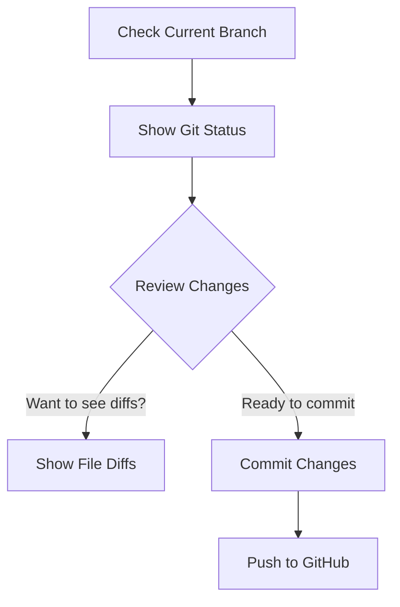

# Plan for Reviewing, Committing, and Pushing Changes to GitHub

## 1. Confirm Current Branch
- Ensure you are on the correct branch (`main`).
- _Status: Confirmed (current branch is `main`)._

## 2. Show Git Status
- Run `git status` to display all modified, staged, and untracked files for review.

## 3. (Optional) Show Diffs for Changed Files
- For each changed file, run `git diff <file>` to show the specific changes.

## 4. Commit Changes
- After reviewing, commit the selected changes with your chosen commit message.

## 5. Push to GitHub
- Push the committed changes to the remote repository on GitHub under your account "Malaeu".

---

## Visual Plan

---

**Next Steps:**  
Switch to code mode to execute the following:
- Show `git status` output for review.
- Optionally show diffs for changed files.
- Commit and push changes as directed.